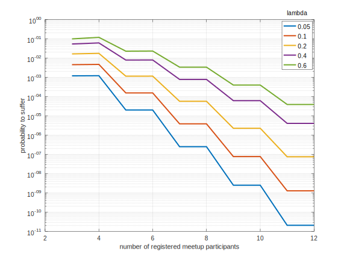

# Adversary Model
We categorize users into the following psychological profiles for later scenario analysis:

## Fundamental Profiles
### Honest  

Will comply with the rules

### Greedy  

Will try to cheat the system for his/her own benefit. Will collude with others

Strategies:
  * Get reward without showing up
  * Sign sybil id's to collect more rewards

### Saboteur  

Will try to hurt the system, even if this comes at a cost. Will collude with others

Strategies:
  * turn meetups invalid
  * demoralize other participants by preventing them to get reward


## More Roles

### Sybil 

An identity that has no bijectively exclusive relationship with a participant. It can however have a bijectively exclusive relationship with a person who doesn't attend any meetup.

### Manipulable 

An honest person that can be convinced to break the rules by social pressure. Will not strive for economic benefit.

## Collusion Organizations

### evil.corp
An organization of the greedy or saboteur participants. 

Strategies: 
* undermining randomization by sharing information and key pairs to allow collusion attacks at meetups

# Threat Model
We assume 

1. The majority of ceremony participants with reputation sending their signed claims to the blockchain location is honest.

*Reputation* here means having attended at least one of the last two ceremonies and having been rewarded.

# Rule Design

When designing rules there's a tradeoff beween preventing either the greedy or the saboteur's success. We can introduce very restrictive rules that will successfully prevent sybil attacks by the greedy, but these will make it very easy for the saboteur to demoralize participants by turning meetups invalid deliberately.

## Rules
TODO: This is work in progress....

### Meetup Assignment

1. A meetup has at least <font color="green">3</font> assigned participants
1. A meetup has at most <font color="green">12</font> assigned participants
1. Only <font color="green">1/4</font> of assigned participants may have zero reputation (be newcomers)
    * *this rule directly impacts the maximum adoption rate. A population of 1M will take at least* log(1M/12)/log(4/3) <= 40 ceremonies 

### Meetup validation

1. (NEEDED?) The signature [reciprocity](https://en.wikipedia.org/wiki/Reciprocity_(network_science)) is at least <font color="green">X</font>
1. (NEEDED?) The reciprocal edge connectedness is at least M-2, where M is the number of participants with at least one signature by another party.
1. (OK) At least <font color="green">two</font> participants signed each other mutually
1. (OK) Disqualify a participant if her vote is not equal to the number of participants signed by her.

### UBI/Reward Issuance
In order to receive a UBI, a participant 
1. (OK) must be registered and assigned to the meetup
1. (OK) the meetup must be valid
1. (TODO: ARGUE THRESHOLD) must have her claim signed by at least <font color="green">1/3</font> of registered participants
1. (OK) must have signed the participants that are necessary to fulfill rule above in return

# Remote Attacks

## Flooding Attack

An adversary could register large numbers of fake participants who will never show up. This could prevent legit persons to participate.

Mitigation: 
  * Limit the number of assigned participants with no reputation

# Non-Protocol Threats

## Aggression, Detention
If meetup locations are publicly known, participants could face aggression from saboteurs or they could be detained if participation is suddenly judged illegal.

Mitigation: 
* The set of possible meetup locations has to be significantly larger than the need in order to host all participants.

## Abduction
If celebrity meetup participants can be linked to their names and meetup locations in advance, they might get kidnapped

Mitigation: 
* Make sure meetup assignments are kept confidential until the meetup has passed.


# Behavioural Meetup Scenario Analysis
The scenario analysis is structured by the number of participants who were assigned to a meetup

## 3 Registered Participants

### Happy Flow
All participants only sign for persons present at meetup location. 


```
reciprocity = 1.0
reciprocal edge connectedness = 2
```

Noshow of one is treated with mercy for attendees


```
reciprocity = 1.0
reciprocal edge connectedness = 1
```
### Attacks

#### Social Engineering
Adversary B talks A into signing his sybil ID


```
reciprocity = 1.0
reciprocal edge connectedness = 2
```

As there is no honest participant in this meetup, this attack is out of scope of our threat model.

Mitigation
* randomized meetups should reduce the chance that someone could be assigned with his sybil to the same meetup. In weakly populated areas, this can happen easily though

*this scenario violates thread model assumptions*

#### Exclusion

Adversary B refuses to sign A and signs C instead


A variant of this would be that B isn't even present at the meetup

```
reciprocity = 0.5 (1.0)
reciprocal edge connectedness = 1
```

Mitigation **none**
* randomized meetups should reduce the chance that someone could be assigned with his sybil to the same meetup. In weakly populated areas, this can happen easily though. evil.corp could also increase chances.
* Only allow meetups with more participants (>=4?) in order to reduce the impact of a single participant on outcome.

*this scenario violates thread model assumptions*

## 4 Registered Participants

### Oversigning


Variant:
* B and C are not present at meetup, removing the reciprocal edges to A

```
reciprocity = 1.0
reciprocal edge connectedness = 2
```

Mitigation: 
  1. (NOK) Introduce **Reputation** (previous attendance to successful meetups)
  2. (NOK) Introduce Rule *"lowest vote with reputation wins"*
    * This rule, however, will cause B, C, and D to vote "3" showups and to refuse to sign A. Reputation doesn't help because B and C could have reputation as well.
  3. (NEEDED?) quarantine non-consistent meetups
  
At this meetup, 3/4 of registered participants are malicious.

*this scenario violates thread model assumptions*

### Oversigning light


```
reciprocity = 1.0
reciprocal edge connectedness = 1
```
Mitigation
* only accept subgraph with recipr. edge connectedness of M-2 for M=4 here. This will cut off D.

### Location Spoofing


C and D could pretend to be at the meetup location. The ceremony validation has no way to know if A-B is legit or C-D.

Variants:
  * D could be a real person colluding with C

Probability:
  * low because of randomization if number of meetups assigned is high
    * evil.corp could redistribute sybil id's after meeting assignments, undermining randomization

Mitigation: 
  1. (NOK) track participant locations and require plausible movement trajectories before meetup. **not sound** because it is easy for C+D to spoof realistic trajectories
  2. (NEEDED?) Quarantine: The validator can detect that the meetup is split and therefore not consistent. Issuance could be conditional to future ceremony attendance
  3. (OK) The pair with higher reputation wins, the other doesn't get a reward issued.
  3. (NOK) invalidate non-consistent meetups, preventing 2 illegit rewards while demoralizing 2 honest participants.

At this meetup, 1/2 of registered participants are malicious.

## 5 Registered Participants


Mitigation:
* Disqualify participant if vote != number of peers she signed


Mitigation:
* *none*, if C,E,D all have reputation. the majority can always win. 

*This violates threat model assumption 1*


# Conclusion

As long as the threat model assumptions are held, we can find a set of rules that prevents:
* issuing more rewards than there are honest participants (while there is no guarantee that every honest participant will get a reward in face of malicious behaviour)

The probability that you as a participant experience a meetup with evil majority follows the poisson cumulative distribution function:

Given the overall proportion of malicious actors , the probability that you (being an honest actor) will suffer from malicious behaviour at one specific meetup depending on the number of participants in your meetup *n* is

[code](./probability_of_malicious_majority.m)


