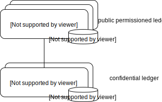

# Encointer "Cantillon" Testnet Specification

This document specifies a first testnet for encointer with the working title "Cantillon". 

## Key Differences with [Encointer Whitepaper](https://github.com/encointer/whitepaper)

  * no dPOET consensus. 
    * This testnet shall become a parachain to [Kusama](https://kusama.network/) based on [substrate](https://substrate.dev)
    * no decentralization. The Parachain will feature PoA consensus with Kusama as root-of-trust.
  * no proportional fees. Classical per-transaction base fees will be applied
  * confidential state updates will be implemented with [SubstraTEE](https://github.com/scs/substraTEE)
  * no private smart contracts yet
  * ceremonies will happen daily at high sun instead of every 41 days.
  
## Validators

The Cantillon testnet will be validated (centralized) by encointer.org in order to facilitate easy upgrades and focus on the essential features instead of security. 

Cantillon is a parachain to Kusama, a decentralized root-of-trust.
The Encointer mainnet is planned to become a parachain or parathread to Polkadot, even after implementing dPOET.

## Tokens

### NCTR
  * unit: 1 NCTR = 1 exa WINK (10^18). a wink is the smallest (atomic) unit of NCTR
  * initial supply: 0
  * supply cap: none
  * nominal inflation: every ceremony issues 1.0 NCTR per legit participant

Encointer tokens (NCTR) are different than global cryptocurrencies. NCTR are geo-located/local tokens. They can be transferred globally, but they carry an attribute we call "seed" of the region where the first meetup of a regions cluster took place. 
The Testnet will allow any group of at least three people anywhere in the world to bootstrap their own new seed. Subsequent meetups in the same region will carry that seed and define that region's local currency.

NCTR issuance and transfers are private. The ledger is managed off-chain by SubstraTEE workers.

NCTR tokens are issued as rewards to ceremony participants.

### ERT
  * unit: 1 ERT = 10^18 atto ERT (smalles atomic unit, no specific name)
  * initial supply: 1M ERT, owned by encointer.org
  * supply cap: 1M ERT
  * nominal inflation: none
  
The native token of the encointer blockchain is Encointer Registry Token (ERT). Its sole purpose is to pay tx fees for testnet transactions. (The final encointer chain will not need this token as transaction fees will be proportionally paid in NCTR and spam-prevention will be done with POET. But as long as SubstraTEE works through indirect invocation, we need fees in native currency to prevent spam)

## Usage Scenarios

### Try Real Ceremonies

Users can download the encointer android app from the play store and get ERT from a faucet to get started.

They can then register for daily rehearsal ceremonies in their region, eventually bootstrapping their own seed. 

### Analyze Scalability with Pacific Bot-Ceremonies

In order to simulate different scenarios of adoption we will create bot-clusters which will bootstrap a seed in the middle of the pacifc (to avoid any overlap with real ceremonies mentioned above). The agents in these clusters will participate at most ceremonies and emulate a vivid expanding population of users.

### Register Encointer-Worker

Users who wish to run a worker can register their Intel SGX HW and run a worker in *SGX debug mode*. At a certain stage we may require workers to run in *SGX production mode* (which requires a commercial license with Intel)

## Why naming the testnet after Richard Cantillon?
Richard Cantillon was an economist often cited for the [Cantillon Effect](https://mises.org/library/5-cantillon-effects), 
which describes the effect of money issuance on inequality. The first recipients of newly issued money (nominal inflation) experience an increase in wealth, while those who do not receive it experience a decrease in wealth.
